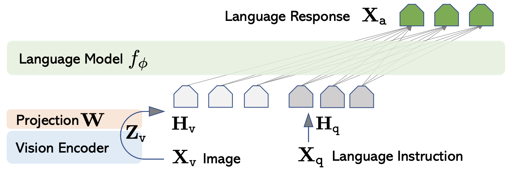
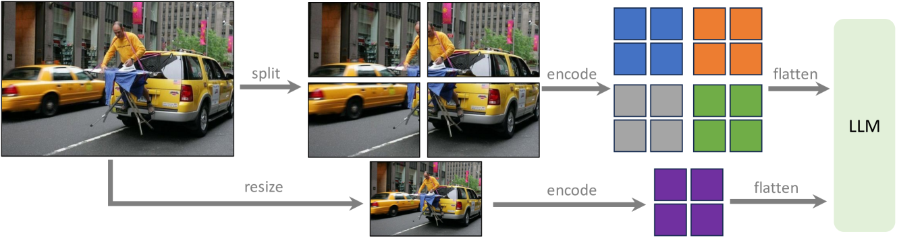
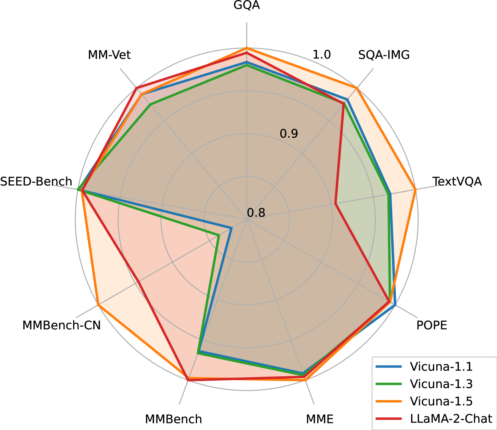
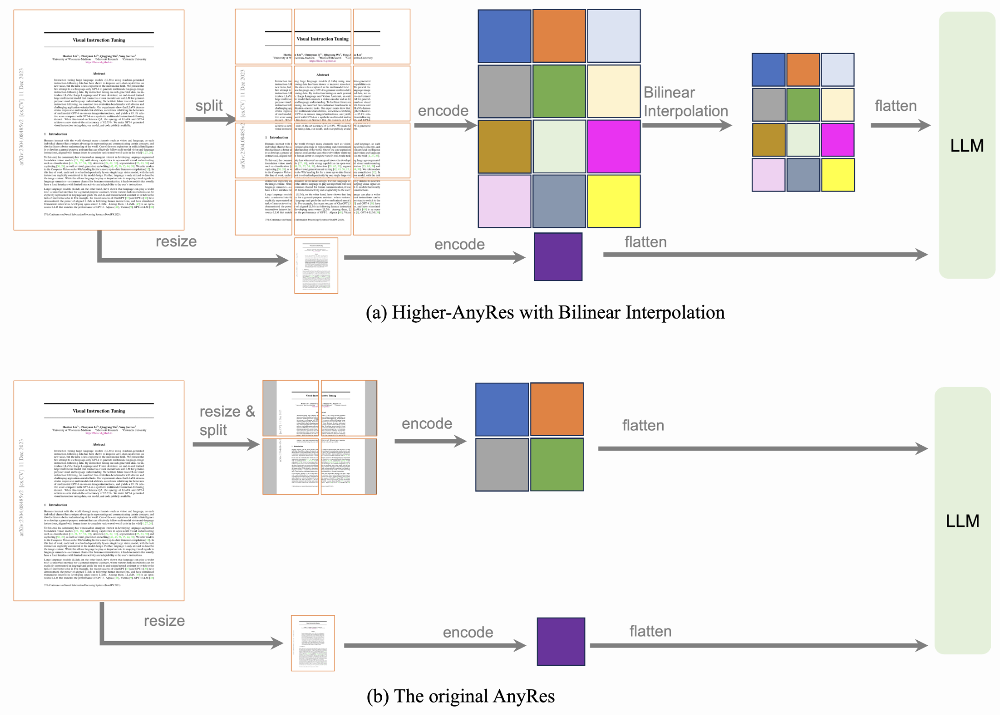
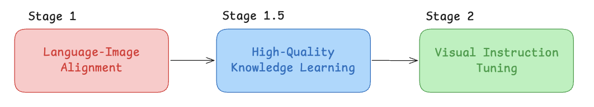
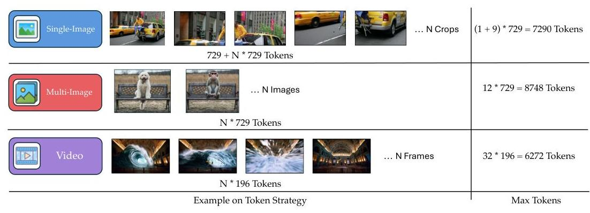
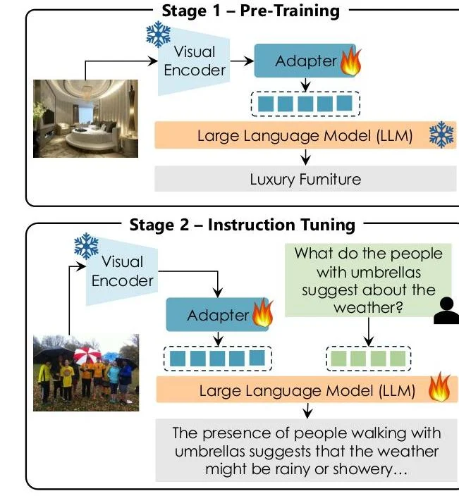

There has been a few mainstream VLM model families. I will cover them in a series of blogs. In this way, we will dive into the LlaVa family!

  
Table of Contents

  <ul style="margin-top: 16px; line-height: 1.8;">
    <li><a href="#llava-the-origin-of-llava-family" style="text-decoration: none; color: #333;">LlaVa</a></li>
    <li><a href="#llava-15-an-upgrade" style="text-decoration: none; color: #333;">LlaVa 1.5</a></li>
    <li><a href="#llava-next-blog-series" style="text-decoration: none; color: #333;">LlaVa-NEXT</a></li>
    <li><a href="#llava-onevision" style="text-decoration: none; color: #333;">LlaVA-OneVision</a></li>
    <li><a href="#llava-more" style="text-decoration: none; color: #333;">LlaVa-MORE</a></li>
  </ul>

# LlaVa, the origin of LlaVa family

LlaVa, a.k.a. Large langauge and Vision Assistant, is introduced by Liu et al. in Dec. 2023 brings instruction following to the field of VLMs. Previous multimodal systems either focused on specific tasks or relied on orchestrating multiple specialized models, lacking the unified, general-purpose instruction-following capability demonstrated by text-only LLMs.

While the authors used a clever trick for data creation (at that time, instruction following data is scarce), I won't get into detail on that. 

## LlaVa Architecture

LlaVa's architecture is simple. It is made up of three main components: 
1. Vision Encoder
2. Language backbone 
3. Single projection layer for connecting vision encoder output with language model

To create LlaVa, the authors combine pre-trained componenets in order to leverage existing capabilies while enabling multimodal instruction following. 

Specifically, the authors used:
1. CLIP ViT-L/14 (note, at this time SigLip has not been popularized yet)
2. Vicuna 
3. Just a single layer, a simple linear transformation `W` that connects the vision encoder and LLM

This trainable matrix converts CLIP visual features $Z_v$​ into language embedding tokens $H_v$​ that match the LLM's word embedding dimensionality. 

Mathematically: $H_v = W \cdot Z_v$

## LlaVa Training

LlavVa's training procedure is divided into two steps. Its goal is to preserve pre-trained knowledge while enabling mutlimodal understanding/instruction following. 

### Step 1: Pre-training for Feature Alignment

The goal in this stage is to align visual features with the langauge model's token space. 

So for this stage, we **only train the projection layer** and freeze both the vision-encoder and the langauge model. This stage acts as a "visual tokenizer" for the frozen LLM and completes efficiently within 4 hours on 8 A100 GPUs.

  

    💡
    <strong>How does pre-training work for VLM?</strong>
  

  

  
  
During VLM pretraining, each example contains an image, a simple instruction such as “Describe the image,” and its caption. The vision encoder converts the image into visual features <em>Zv</em>, and a trainable linear projection maps them into the LLM’s embedding space: <em>Hv = WZv</em>. The projected visual tokens and instruction are then given to the frozen LLM, which predicts the caption autoregressively, one token at a time. Whatever is not frozen is updated with the next-token cross-entropy loss:

  
  

    <em>L</em>(<em>W</em>) = - &sum;<em>i</em>=1<em>L</em> log <em>pW</em> (<em>xi</em> | <em>Hv</em>, <em>X</em>instruct, <em>x&lt;i</em>)
  

  
  
where <em>xi</em> is the correct caption token and <em>x&lt;i</em> are the preceding caption tokens. Thus, the objective is to train the projection to translate visual features into representations that the LLM can use for caption generation.

Note that: skipping the feature alignment pre-training stage resulted in a substantial 5.11% accuracy drop, confirming this stage's critical role in preserving pre-trained knowledge while enabling multimodal integration.

### Step 2: Fine-tuning End-to-End 

In this step, **both projector layer and language model parameters are updated** while vision-encoder still remains frozen. For multimodal chatbot capabilities, the model trains on the 158K GPT-generated instruction-following data. This stage requires approximately 10 hours on 8 A100 GPUs.

  

    💡
    <strong>How does fine-tuning work for VLM?</strong>
  

  

  
  
During VLM fine-tuning, each example contains an image, a user instruction, and a desired assistant response. The frozen vision encoder extracts visual features, and a projection layer maps them into the LLM's token-embedding space; the LLM then generates the response autoregressively. The model is optimized with next-token cross-entropy over the assistant response:

  
  

    &#8466;FT(<em>W</em>, &phi;) = &minus; &sum;<em>i</em>=1<em>L</em> log <em>pW, &phi;</em>(<em>yi</em> | <em>Xv</em>, <em>X</em>instruct, <em>y</em>&lt;<em>i</em>)
  

  
  
This has the same mathematical form as pre-training's loss, but the datasets differ. Specifically, datasets for fine-tuning include diverse instruction-following examples. Examples include: conversations, detailed descriptions, and visual reasoning.

# LlaVa 1.5, an upgrade

LlaVa became very popular, but a lot of its flaws became very obvious as well. LlaVa 1.5 works on patching those flaws. 

There isn't much to talk about its architecture. LlaVa 1.5's architecture is very similar to that of LlaVa 1.0 (with some small modifications that I will get to)

The training process is also very similar to LlaVa 1.0, with the two-stage training. So I skip this. 

## Key Improvements 

### Enhanced Vision-Language Connection
In LlaVa 1.0, we have a simple 1-layer connector mapping visual encoder output to the langauge layer. 

This might have been too small. 

So here, we increase the layer count to 2! Making it a MLP. 

It essentially provides enhanced representation power for mapping between visual and linguistic feature spaces. 

### Response Format for Prompting 

A critical problem to LlaVa 1.0 is the "multitask balancing problem". How can the VLM generate both short-form answers (required for academic VQA benchmarks) and long-form conversational responses. 

LlaVa-1.5 implements response format prompting by appending specific formatting instructions to queries when particular response styles are desired. 

For instance:
- VQA tasks: "Answer the question using a single word or phrase."
- multiple choice: "Answer with the option's letter from the given choices."

### Expanded Training Data Integration

LLaVA-1.5 incorporates additional publicly available datasets to enhance specialized visual capabilities:
- VQA datasets: VQAv2, OKVQA, A-OKVQA for improved factual question answering
- OCR datasets: OCRVQA, TextCaps for text recognition and reading comprehension
- Region-level datasets: Visual Genome, RefCOCO for spatial reasoning
- General knowledge: GQA dataset for comprehensive visual reasoning
- Conversational enhancement: ShareGPT text-only data for improved general language capabilities

### Scaling to Higher Resolutions
To overcome the fixed resolution limitations of pre-trained CLIP models, LLaVA-1.5-HD implements an approach for processing higher-resolution images. 

  

    💡
    <strong>Why does CLIP have this limitation?</strong>
  

  

  
  
Standard CLIP vision encoders are trained at a fixed input resolution—typically $224 \times 224$ or $336 \times 336$, with positional embeddings tied to that patch grid. Hence, they are fixed resolution. Directly increasing the resolution would require adapting those embeddings and usually fine-tuning the encoder.

  

  

    ⚠️
    <strong>LlaVa 1.5 HD</strong>
  

  

  
Note: LlaVa 1.5 do not have this feature, only LlaVa 1.5-HD does!

The method is essentially the following:

1. Dividing input images into smaller patches (e.g., 224×224) that fit within the pre-trained encoder's input size
2. Processing each patch separately through the CLIP encoder
3. Combining patch features into a unified representation
4. Concatenating features from a downsampled version of the original image to provide overall context and mitigate splitting artifacts

### Selection of Language Backbone Matters... a lot!

The choice of base language model significantly impacts final performance. Vicuna-v1.5 (based on LLaMA-2) consistently outperforms earlier variants, highlighting the importance of a capable and well-aligned foundation model for multimodal tasks.

### Image Resolution Matters to Hallucination

Another significant finding relates to the relationship between **input resolution and model hallucination**. 

Authors suggest that insufficient visual input resolution can lead models to hallucinate details that cannot be perceived from low-resolution images. Scaling to higher resolutions (LLaVA-1.5-HD at 448×448 pixels) significantly reduces hallucination, indicating that some perceived hallucinations may stem from inadequate visual information rather than inherent model deficiencies.

# LlaVa-NEXT Blog Series

There has been several blogs regarding LlaVa-NEXT, but I just want to include some of the interesting points. (Mainly from the last blog)

It is an obvious fact that training data mixture matters a lot to final VLM performance. 

However, what interest us is: **What else influences visual instruction tuning beyond the instruct data itself?**

Well, here we will explore 3 ideas. 

1. Architecture: How does different LM backbone or vision encoder affect performance? To what degree?
2. Visual Representation: The representation of visual signals is related to both image resolution in raw pixel space and the number of tokens used in the feature space. Which is more important? How do we strick a balance? 
3. Training Strategy: Data is critical. How does varying training data amount, quality, and trainable modules affect final result?

We dive in 1 by 1.

## Architecture

### LM Backbone Choice

A few useful observations to keep in mind. 

1. **Stronger LM Backbone** translate to stronger multimodal performance. Hence, within a model family, scaling model size directly demonstrates free gains in multimodal performance across all benchmarks(cross-modal generalization). This can potentially reduce the need for extensive additional training specific to multimodal tasks, whose high-quality data might be more difficult to obtain

2. **Lower training loss** typically indicate improved performance across a range of tasks. Also, larger/stronger LM backbone is observed to lead to faster convergence + reach to lower loss value more easily

3. **Watch out for LR!** Larger LMs require a smaller learning rate to avoid unstable training issues. What they observed is that having spikes in the training curve often indicate worse performance even if the loss values converge to the same value. The authors experimented with a range of LR combinations for (LLM, vision-encoder), including: (2e-5, 2e-6), (2e-5, 1e-6), (1e-5, 2e-6), (1e-5, 1e-6), (5e-6, 1e-6), and (5e-6, 5e-7). They found that **vision encoder's learning rate should always be 10x or 5x smaller than the LM decoder's learning rate to stabilize training.** Although they didn't observe significant differences in loss values when tweaking the LLM's learning rate from 2e-5 to 5e-7, the final performance on evaluation benchmarks varied significantly. In the end, they went with (2e-5, 2e-6)

### Vision Encoder

The authors also considered using different vision encoders to evaluate their impact. 

Specifically, they are interested in the differences in:
- encoder model size
- resolution
- amount of visual tokens
- pretraining data

Due to the nature of different vision encoders, the amount of time required to integrate into LLM varied dramatically. 

For vision encoders in MLLM, the visual **representation on (resolution, #token) and pre-training data play a more significant role than model size**. This is because visual representations allow encoding more visual details, and pretraining data allows the model to encode more visual knowledge. The model size with contrast loss shows less scaling gains.

## Visual Representation

This seemed like the perfect transition spot to.... visual representation!

Visual representations is related to both the resolution in the raw pixel space and the number of visual tokens. While scaling either of them improves performance, they also introduces computation overhead. 

  

    💡
    <strong>Token in Visual Space?</strong>
  

  

  
  
Quick clarification... each pass of the vision-encoder gives N tokens in the visual feature space. This depends on the output feauture space. 

  
For example, for a base image, the vision encoder could output a spatial feature grid with <em>729</em> tokens. Since <em>729 = 27 * 27</em>, each token corresponds roughly to a spatial region of the encoded image, not to a word or an entire image.

What we want to know then, is how to strike the best (resolution, #token) configuration for a balance of performance and cost.

Before we investigate this, we need to understand the **AnyRes** strategy proposed by the authors. 

The original AnyRes technique (Figure B) employs a grid configuration of {2x2, 1x{2,3,4}, {2,3,4}x1} to adapt to images of different resolutions while preserving data efficiency. 

However, problem arises when we need more than 4 grid when our image is higher resolution. 

Hence, the authors proposed **Higher-AnyRes with Bilinear Interpolation** where the image is divided into more grids. Then, they use a bilinear interpolation strategy to prevent having an excessive amount of visual tokens fed into the LLM. 

  

    💡
    <strong>What is Bilinear Interpolation?</strong>
  

  

  
  
At a high level, bilinear interpolation is a mathematical technique used to resize images by smoothly blending the four nearest pixels to calculate a new one. 

  
In this context,  it acts as a smart compression tool.

  

What the authors found....

The scaling of both resolution and amount of tokens in visual feature leads to improved performance, especially on tasks that require visual details. To strike a balance of performance and cost, they observe that the **scaling of resolution is more effective than the scaling of visual token numbers an LLM takes in**

## Insight on Training Strategy

While previous LlaVa-related works usually employs a two stage training strategy:
- Stage 1 - Language-Image alignment training, and only train the projector mlp
- Stage 2 - Vision instruction fine-tuning, and fine tunes both LLM and projector mlp

The authors thought of a slight edit and a new training paradigm:
- Stage 1 - Teaches the model how to see (basic alignment).
- Stage 1.5 - Teaches the model deep facts and how to read (high-quality knowledge).
- Stage 2 - Teaches the model how to talk to you (instruction tuning).

Stage 1 and 2 should already be very familiar faces to you, so I won't explain. 

Stage 1.5, however, is quite interesting. 

While the training setting for the model is the same as that of Stage 2, the goal of this training stage is different. Before teaching the model how to act like a helpful chat assistant (which is Stage 2), the researchers want to cram it full of high-quality facts, detailed visual awareness, and reading comprehension. 

The data used in this stage is very similar to that of Stage 1. However, Instead of the simple, short captions used in Stage 1 (e.g., "A dog catching a frisbee"), Stage 1.5 feeds the model highly complex visual data, such as:

- Re-Captioned Detailed Descriptions: They use a stronger, larger AI (LLaVA-NeXT-34B) to rewrite basic image captions into long, highly detailed paragraphs describing everything in the scene.

- Document and OCR Data: They utilized the Text Reading subset from the UReader dataset, totaling 100K, which is easily accessible through PDF rendering. We used this text reading data along with the SynDOG EN/CN 1M datasets.

- High-Quality Translations: They used the original ShareGPT4V images and utilized GPT-4V provided by the Azure API to generate detailed Chinese caption data, aiming to improve the model's capability in Chinese.

The results are also quite positive!

1. Enhanced Performance with Recaptioned Data: Models trained with recaptioned data (ReCap) datasets, show a trend of enhanced performance in tasks requiring detailed image descriptions and document understanding.
2. Enhancement through New Domain Knowledge: The introduction of new domain knowledge is essential.
    - Document/OCR data, particularly UReader 100K and SynDOG EN/CN 1M, provide substantial benefits in understanding structured text data.
    - ShareGPT4V Chinese Caption data, enhances the model's ability to understand and process multilingual data. This improvement is evident in the increased scores across several metrics, especially in the Chinese version of Image-DC and CMMU, demonstrating the model's enhanced multilingual capabilities.
3. Balanced Improvement with Mixed Data Approach: Combining high-quality recaptioned data, document data, and text data (e.g., Recap-118K, UReader 100K, and Evol-Instruct) leads to a well-rounded model capable of performing well across diverse tasks. Despite the total amount being under 500K, this efficient mixed data approach results in balanced improvements across most metrics. This suggests that a comprehensive and diverse knowledge base is crucial for the effectiveness of multimodal models.

# LlaVA-OneVision

Since this piece of work was released at a relatively similar time as LlaVA-NEXT blog, so there was not too much differences. But I do want to emphasis on some changes. 

## Architecture

While the design philosophy of leveraging pre-trained components with minimal architectural complexity is still the case here, the components are different. 
- Vision Encoder: SigLIP
- LM backbone: Qwen-2 LM series
- Connector MLP: again, the 2-layer MLP

## Visual representation strategy 
Their strategy is very similar to the Higher-AnyRes with Bilinear Interpolation. 

But the authors added an innovation to their approach. Rather than developing specialized architectures for each input type, LLaVA-OneVision employs flexible visual representations that enable seamless processing of single images, multi-image sequences, and videos within the same framework.

The approach divides images into `a × b` crops, each processed by the vision encoder, with a crucial enhancement: when the total number of visual tokens exceeds a threshold `τ`, bilinear interpolation reduces tokens per crop, prioritizing resolution over excessive token counts.

The modality-specific token allocation demonstrates careful engineering:

- Single-Image: Supports configurations up to 6×6 crops with maximum 7,290 tokens, using long sequence representation that mimics video input to facilitate transfer learning
- Multi-Image: Employs simple padding with base resolution (384×384) for up to 12 images, totaling 8,748 tokens maximum
- Video: Processes up to 32 frames at 196 tokens each through bilinear downsampling, resulting in 6,272 tokens maximum

This design ensures similar maximum token counts across modalities, promoting balanced visual representations and enabling effective cross-scenario capability transfer.

## Training Process

The authors here employ very similar process as LlaVa-NEXT blog series. 

The model employs a progressive curriculum learning approach with increasing complexity:
- Stage 1 - Language-Image Alignment focuses on aligning visual features with the language model's embedding space, updating only the projector using base image representations.
- Stage 1.5 - High-Quality Knowledge Learning injects new knowledge using curated synthetic data, updating the full model with enhanced AnyRes representations supporting up to 5× more visual tokens.
- Stage 2 - Visual Instruction Tuning operates in two phases:
    - Phase 1 trains on 3.2M single-image instructions for strong foundational performance
    - Phase 2 fine-tunes on the 1.6M mixed OneVision data, enabling capability expansion and cross-modal knowledge transfer

# LlaVa-MORE

Athough this work is not actually a continuation of the main LlaVa series, it is pretty interesting so I thought to include it. 

A limitation in the LlaVa series is that most state-of-the-art models converge around similar architectural choices, typically relying on LLaMA-derived language models and CLIP-based visual encoders.

Hence, the authors setout to addresses this gap by introducing a systematic comparative study that explores diverse combinations of language models and visual backbones under unified training and evaluation protocols. 

## LlaVa-More Training

The authors sticked with the traditional 2 stage approach. 

- Stage 1 - Pre-Training (Visual-Linguistic Alignment): Only the vision-to-language adapter weights are optimized while keeping both the visual encoder and LLM frozen. The objective is to align image features with the text embedding space using image-caption pairs. The training utilizes 558,000 samples from web-scale multimodal datasets including LAION, CC3M, and SBU for one epoch.

- Stage 2 - Instruction Tuning: This stage fine-tunes the model on high-quality visual instruction-following data, updating both the multimodal adapter and LLM parameters. The training enhances conversational abilities and multimodal reasoning using next token prediction as the loss function.

## Architecture Investigation

The study investigates multiple architectural components systematically. For language models, it examines both small-scale options (Gemma-2 2B and Phi-4-Mini 3.8B) and medium-scale alternatives (LLaMA-3.1 8B, DeepSeek-R1-Distill-LLaMA-8B, and Gemma-2 9B). 

The visual backbone exploration includes CLIP-based encoders, self-supervised approaches like DINOv2, and enhanced contrastive methods such as SigLIP and SigLIP2, all using the ViT-L/14 architecture.

## Key Findings

### Language Model Performance Analysis
The systematic evaluation of different language models revealed significant insights about scaling versus architectural optimization. Small-scale LLaVA-MORE models consistently outperformed existing baselines, with Phi-4-3.8B demonstrating superior reasoning and generalization capabilities, particularly excelling in MMMU tasks with 5.4% higher performance than Gemma-2-2B.

Among medium-scale models, Gemma-2-9B emerged as the top performer in VQA benchmarks, achieving the highest scores on GQA and AI2D tasks. Notably, some small-scale models like Phi-4-3.8B could outperform certain medium-scale baselines such as LLaVA-1.5-7B on specific benchmarks including Science-QA and AI2D. This finding challenges the conventional assumption that scaling up is the primary path to improved performance, **highlighting the importance of architectural design and fine-tuning strategies.**

### Visual Backbone Comparison
The comparison of visual backbones revealed clear performance hierarchies based on pre-training approaches. Visual encoders pre-trained with image-text data (CLIP, SigLIP, SigLIP2) consistently outperformed self-supervised alternatives like DINOv2 across both model scales. This superiority stems from contrastive pre-training creating features readily aligned with text, simplifying the adapter's role in connecting visual information to language models.

**SigLIP-based backbones established new performance frontiers**, showing substantial improvements over CLIP at both scales. The enhanced performance of SigLIP variants is attributed to massive billion-scale image-text pre-training using sigmoid loss, compared to CLIP's 400 million pairs. **SigLIP2, despite its more complex training recipe, performed comparably to original SigLIP at 3.8B scale and achieved an average 0.4% gain at 9B scale**.

### Pre-training Dataset Impact

The analysis of different pre-training datasets revealed model-size-dependent sensitivities. For small-scale models like LLaVA-MORE-3.8B, exclusively training on LAION often yielded optimal results, winning 8 out of 13 benchmarks and outperforming the original LLaVA mixture. 

Medium-scale models demonstrated greater robustness across different pre-training configurations, showing less sensitivity to specific data sources. The addition of Recap samples (MLLM-generated dense captions) particularly benefited Chinese language fluency and other MLLM tasks for the 9B model.

  

    💡
    <strong>Pretraining Data Takeaway</strong>
  

  

  
  
The source of pre-training data plays a role at small scales, but it does not significantly impact medium-scale models

