So I have recently become interested in computer vision and thought of reading up on the current works. 
There is quite a lot to unpack, so grab a cup of coffee and let's get to it. 

  
Table of Contents

  <ul style="margin-top: 16px; line-height: 1.8;">
    <li><a href="#new-architecture-for-vision-vit" style="text-decoration: none; color: #333;">New Architecture for Vision: ViT</a>
      <ul>
        <li><a href="#dosovitskiy-et-als-vision-trasnformer-vit" style="text-decoration: none; color: #333;">ViT</a></li>
        <li><a href="#wang-et-als-vit-5-vision-transformers-for-the-mid-2020s" style="text-decoration: none; color: #333;">ViT-5</a></li>
      </ul>
    </li>
    <li><a href="#learning-objectives-for-vision" style="text-decoration: none; color: #333;">Learning objectives for Vision</a>
      <ul>
        <li><a href="#radford-et-als-clip" style="text-decoration: none; color: #333;">CLIP</a></li>
        <li><a href="#siglip" style="text-decoration: none; color: #333;">SigLIP</a></li>
        <li><a href="#siglip2" style="text-decoration: none; color: #333;">SigLIP2</a></li>
      </ul>
    </li>
  </ul>

# New Architecture for Vision: ViT

## Vision Trasnformer (ViT)

Since the infamous "Attention Is All You Need" work in 2017 and its massive success in the NLP field, people have thought about applying similar architecture to other fields (such as vision). 

Prior to ViT, image classification task were mainly performed by convolution neural networks (CNNs) which uses convolutional filters to process pixels. Dosovitskiy et al 2020 shows that when scaled to large datasets, pure attention-based models can match/exceed the performance of CNNs. This new architecture challenges the dominant paradigm in computer vision. 

### Architecture

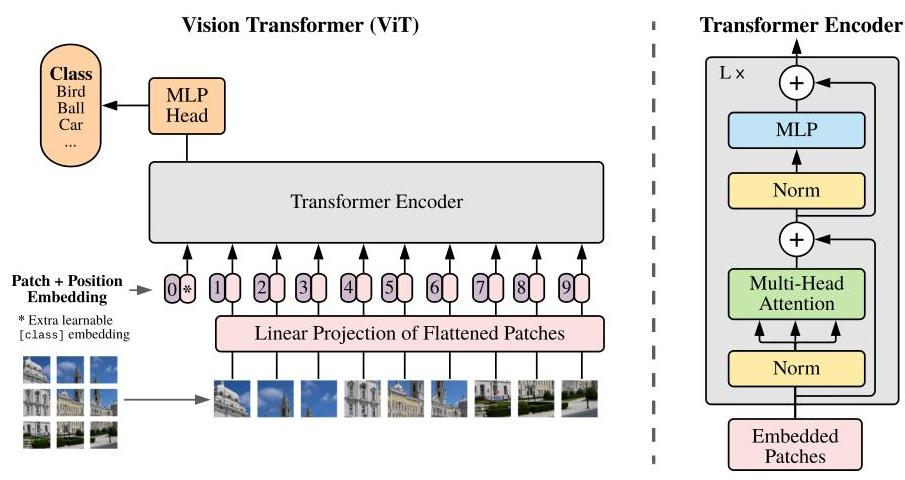

ViT's structure borrows heavily from a standard Transformer encoder with minimal edits. While vastly similar in architecture, their key innovations is their idea of processing an image as a sequence.

For instance, an image processing step goes as follows:
1. Divide into fixed-size patches (model-specific, and size varies from 14x14, 16x16, 32x32)
2. Flatten each image patch via linear projection, this creates the image embeddings
3. Similar to BERT in NLP, add a classification token to the sequence of patches
4. Add position embedding to retain spatial information (Authors found 1D position embeddings work just as well as the 2D variant)

Mathmatically, position embedding process is: $\mathbf{z}_0 = [\mathbf{x}_{\text{class}}; \mathbf{x}^1_p\mathbf{E}; \mathbf{x}^2_p\mathbf{E}; \cdots; \mathbf{x}^N_p\mathbf{E}] + \mathbf{E}_{\text{pos}}$

  

    💡
    <strong>What is a classification token?</strong>
  

  

  
A classification token is a learned vector added at the beginning of the patch sequence. During self-attention, the class token can look at all the image patches, and all patches can contribute information to it. After the Transformer finishes, ViT uses the final class token as a summary of the whole image and sends it to a classifier.

### Main Findings

#### ViT Scales

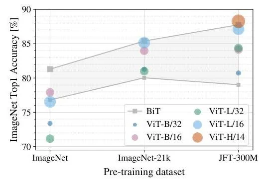

One of the most important result is that ViT scales dramatically with dataset size. 

When pre-trained on smaller datasets like ImageNet (1.3M images), ViT underperforms BiT(the ResNet baseline). 
However, as we increases dataset size, ViT's performance rises quickly and surpasses baseline by a large margin.   

#### ViT is Training Efficient

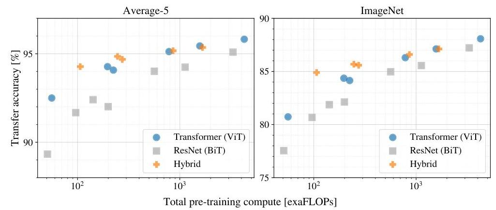

Another advantage of the ViT architecture is that it requires significantly lower computationl resources for pre-training while achieving superior perofrmance. 
At that time, the largest ViT model achieved state-of-the-art results using 2-4x less compute than comparable CNN models.

  

    💡
    <strong>What is a FLOP?</strong>
  

  

    
 <b>1 FLOP</b> = one floating-point addition or multiplication. <b>exaFLOPs</b> means 1018 FLOPs (I.E.one quintillion operations.)

#### ViT is SOTA
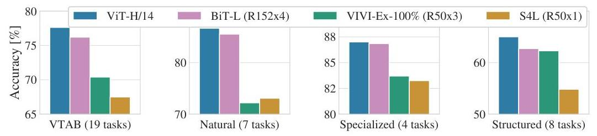

At that time, on multiple evaluation benchmarks including ImageNet, CIFAR-100, and the VTAB suite, ViT models pre-trained on JFT-300M consistently outperformed previous state-of-the-art methods. 

  

    ❗
    <strong>Important Takeaway</strong>
  

  

  
Dosovitskiy et al 2020's central thesis is that <strong>"large scale training trumps inductive bias."</strong> Unlike CNNs, which incorporate strong inductive biases for vision (locality, translation equivariance), <strong>ViT</strong> has <strong>minimal vision-specific</strong> assumptions.

  
This paper shows that for small data regimes, inductive biases (CNN architecture) provide advantages. On the other hand, for large data regimes, generic architectures can learn appropriate representations directly from data, potentially surpassing specialized architectures.

## ViT-5, Vision Transformers for The Mid-2020s

In 2020, ViT revolutionized the computer vision model architecture by applying the original transformer encoder blocks to vision tasks. 
Now, time lapse to 2026, LLM have undergone continuous architectural refinement such as RMSNorm, SwiGLU, RoPE, and QK-Normalization. However, vision-transformers are stagnant and still uses the vanilla architecture. 

This work essentially addresses this gap. They try to integrate existing component-wise refinements that exists for LLMs for vision transformers. 

### ViT-5 Architecture

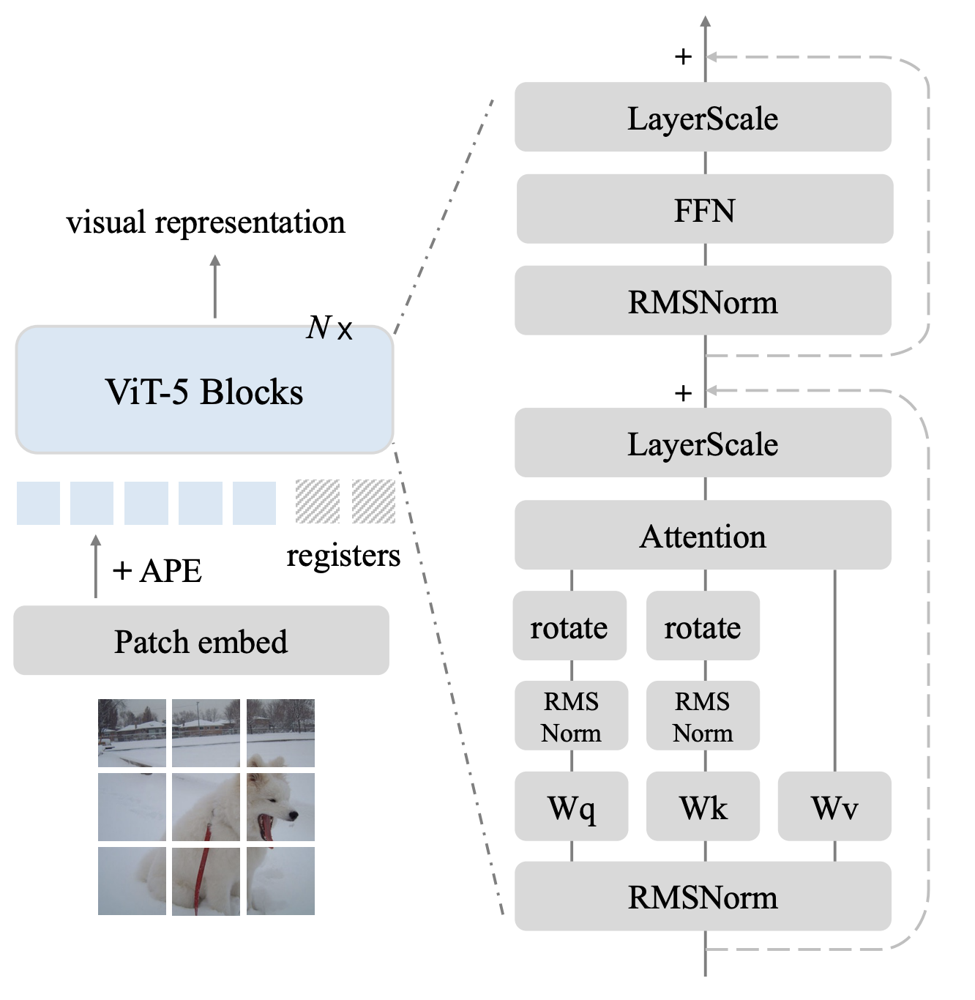

**5 key modifications** to the original ViT design were introduced. So hold on tight. 

#### 1. Layer Scale
Layer Scale is similar to a gating mechanism, and it scales the output of the current sublayer(Attention or FFN). It is also a vector of learned scalars, one per feature channel. 

Mathmatically: $y = x + \lambda \odot \mathrm{(FFN / ATTN)}(x)$

LayerScale is functionally related to post-normalization: both control the scale of a block’s output. But LayerScale is simpler and more flexible because it directly learns the scaling rather than obtaining it indirectly through normalization.

#### 2. RMSNorm
The traditional Layer Normalization is replaced with Root Mean Square Normalization (RMSNorm), eliminating the re-centering operation for **modest performance gains and computational efficiency.**

LayerNorm normalizes activations by both: subtracting their mean, and dividing by their standard deviation. 

RMSNorm skips the mean-subtraction step and only rescales activations according to their root-mean-square magnitude. 

Mathematically: $\operatorname{RMSNorm}(x)=\frac{x}{\sqrt{\frac{1}{d}\sum_i x_i^2+\epsilon}} $

#### 3. SwiGLU
Well, they tried it and ended up not adding it. 

  

    ⚠️
    <strong>SwiGLU</strong>
  

  

  
While SwiGLU is prevalent in modern LLMs, the authors discovered an <b>"over-gating"</b> issue when combining SwiGLU MLPs with LayerScale in ViTs. This combination led to excessively sparse activations and performance degradation. Consequently, ViT-5 retains the original MLP design with GeLU activation.

#### 4. APE and RoPE

  

    💡
    <strong>What is Absolute Positional Embedding for images?</strong>
  

  

  
The image is divided into patches, and each patch receives a learned vector corresponding to its fixed location—top-left, center, bottom-right, and so on. This vector is added directly to the patch’s content embedding before the Transformer processes it: <em>xi</em> = patchi + <em>pi</em> where <em>pi</em> is the learned embedding for position <em>i</em>. Thus, the model can distinguish “this patch is at the top” from “this patch is at the bottom.”

  

    💡
    <strong>What is Rotary Positional Embedding for images?</strong>
  

  

    
 RoPE applies position information inside self-attention by rotating the query and key vectors according to each patch’s coordinates. When a query at one position compares itself with a key at another position, their dot product depends on the difference between their positions—for images, their relative 2D displacement. In simple terms, RoPE changes the orientation of each patch’s attention vectors so the model can infer how far apart and in what direction two patches are. 

Instead of discarding Absolute Positional Embeddings (APE), **ViT-5 incorporates 2D Rotary Positional Embeddings (RoPE) alongside APE**. This hybrid approach addresses APE's limitations with dynamic resolutions while preventing undesirable invariances that a RoPE-only formulation would introduce.

$\text{Position Encoding} = \text{APE} + \text{2D-RoPE}$

#### 5. Register Tokens with Specialized Positioning

Darcet et al., 2024's work demonstrates that ViT needs registers. 

After the image is split into patch tokens, ViT-5 appends four extra learnable tokens to the token sequence.
`[patch₁, patch₂, ..., patchₙ, register₁, ..., register₄]
`

They are added as a learnable workspace: the model can use them to collect global information, pass information between patches, and absorb distracting activation patterns or background artifacts. This leaves the actual patch representations cleaner and makes attention maps more focused.

  

    💡
    <strong>What are Register Tokens?</strong>
  

  

    
 Register tokens are extra learnable tokens appended to the image-patch tokens. They do not correspond to any image region; instead, they act like a shared workspace where the Transformer can store and organize useful global information. They can also absorb distracting background patterns, leaving patch tokens and the class token with cleaner representations. 

The problem is that registers also participate in attention, so they need positional treatment. These register tokens receive separate 2D RoPE with significantly higher frequency base than patch tokens. Its different frequency makes the positional behavior of registers distinct from that of patches. 

ViT-5 uses four learnable registers in each model size.

#### 6. qk Normalization

ViT-5 incorporates QK-Normalization, applying RMSNorm to queries and keys within self-attention, significantly enhancing training stability and reducing loss spikes. 

### ViT-5 Architecture Insights

Through ablation studies, the authors concluded that each of the architectural modifications contributes positively to overall performance, with their removal consistently leading to accuracy drops. The components exhibit complementary rather than redundant effects, and their impact varies across model scales.

# Learning objectives for Vision

While ViT were revolutionary, perhaps the fuel that unlocked its potential could be attributed to the following works.

## CLIP

Traditionally, computer vision has relied on supervised learning with manually labeled datasets. While this approach has led to significant advances, it comes with important limitations: **models trained this way can only recognize a fixed set of visual concepts**, and **creating large labeled datasets is expensive and time-consuming.**

Meanwhile, the field of natural language processing (NLP) has seen a revolution through pre-training models on vast amounts of raw text, enabling them to learn versatile representations that transfer to many downstream tasks. There is a question to be asked: **Could we do the same for computer vision?**  (Spoiler, yes)

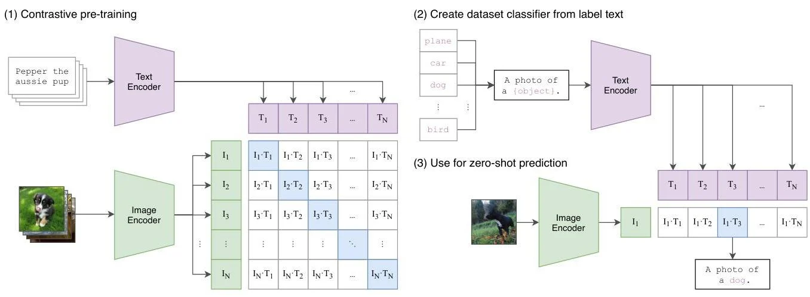

  

    ❗
    <strong>Paradigm Shift</strong>
  

  

  
This question led to the development of CLIP (Contrastive Language-Image Pre-training) where a model learns from 400 million image-text pairs collected from the internet, without requiring manually curated labels.

  
CLIP represents a paradigm shift in how we train vision models, <b>moving away from specialized datasets toward learning from the natural language supervision that's readily available online.</b>

### CLIP Introduction

CLIP is a neural network that jointly trains an image encoder and a text encoder to predict which images go with which text descriptions. Rather than training a model to classify images into predefined categories, CLIP learns to connect images with their textual descriptions in a shared embedding space.

During inference it uses both encoders to compare an image against text description. A simple way to remember what is happening:
- **Training**: learn image and text encoders whose outputs agree for matching pairs.
- **Inference**: encode an image and candidate texts, then choose or retrieve according to similarity.

A **key innovation** from CLIP is its zero-shot generalization to new images. CLIP can generalize to new tasks without additional training, similar to how humans can recognize objects they've never explicitly been trained to identify. This approach is fundamentally different from traditional computer vision models that require task-specific fine-tuning. 

### Contrastive Learning Objective

Instead of predicting the exact words in a caption (as in image captioning), CLIP learns to identify which caption goes with which image in a batch. Given N image-text pairs, the model is trained to identify the correct N matches among the N² possible combinations.

  

    ⚠️
    <strong>Intense Batch Size</strong>
  

  

  
Naturally, CLIP trains better with more samples in a batch. This leads to extremely large batch size: 32K samples per batch. Very taxing on resource!

### CLIP Architecture

CLIP is not tied to any specific model.
Instead, it explores various combinations of image and text encoders. 

| Image Encoder Type | Base Architecture | Details & Variants |
| :--- | :--- | :--- |
| **Visual (CNN)** | ResNet | Modified ResNet backbones, (RN50, RN101, RN50x4, RN50x16, RN50x64) |
| **Visual (Transformer)** | Vision Transformer (ViT) | Patch-based Transformer encoders (ViT-B/32, ViT-B/16, ViT-L/14) |
---

| Text Encoder Type | Base Architecture | Details & Variants |
| :--- | :--- | :--- |
| **Text Encoder** | Transformer | A Transformer-based model similar to GPT-2, which encodes text using a masked self-attention mechanism |

The authors found that both ResNet and Vision Transformer architectures performed well, with the larger variants providing better performance at the cost of increased computation. The best performing model was ViT-L/14, which uses a Vision Transformer with 24 layers and patch size of 14x14 pixels.

### CLIP Findings

There are some very impressive results.

#### CLIP has very strong zero-shot performance
Without any task-specific training, CLIP matches the performance of the original ResNet-50 on ImageNet (76.2% accuracy), despite that model being directly trained on ImageNet for many epochs.

#### CLIP is robust to distribution drift 

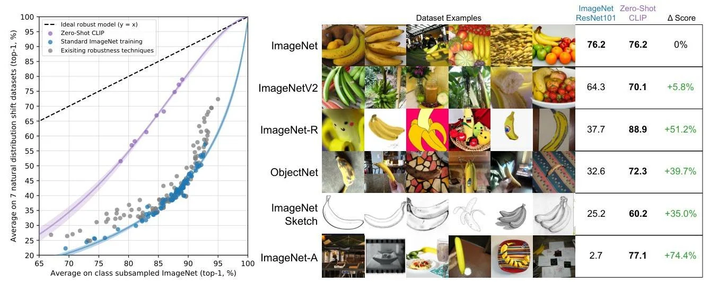

An impressive charactersitic of CLIP is its robustness to distribution shifts. When images deviate from the standard ImageNet distribution, models typically suffer dramatic performance drops. CLIP, however, maintains much stronger performance.

#### CLIP scales

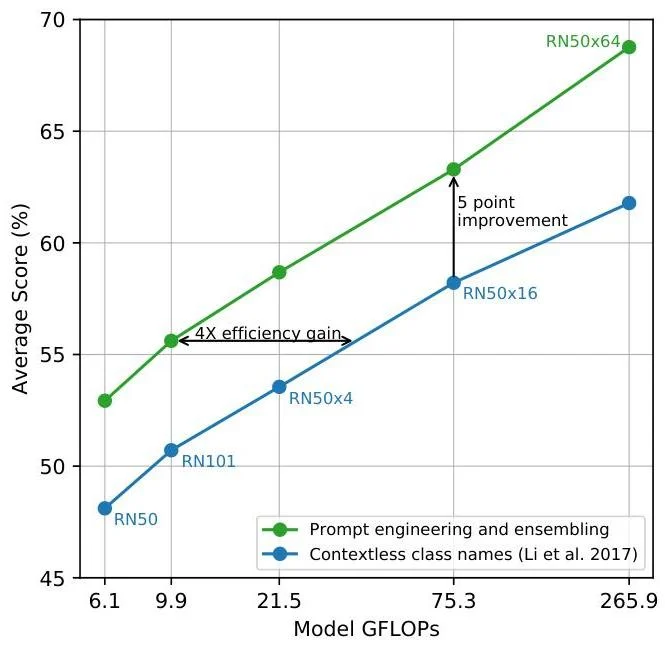

CLIP's performance scales predictably with computational resources, similar to language models like GPT-3. The authors observed smooth scaling of zero-shot performance with model size, amount of training data, and compute.

## SigLIP
CLIP was a huge success. 

But it comes with a big limitations as well: the nature of the training objective requires excessively large batch size. These softmax-based contrastive loss presents significant computational challenges.

Why, you ask?

Well, the cause lies in the global batch normalization. During distributed training (which is necessary for this large batch size), we need to exchange the image and text embeddings across devices using `all-gather`. Otherwise, each device would see only its local batch and could not compare its images against all the negative texts in the global batch.

CLIP uses a softmax contrastive loss. For each image, it compares that image with every text in the batch and tries to make the correct text score highest:

$$
P(T_i \mid I_i)
=
\frac{\exp(s(I_i,T_i))}
{\sum_{j=1}^{|B|}\exp(s(I_i,T_j))}
$$

The denominator normalizes the correct pair against **every text in the global batch**. Therefore, with $|B|$ images and $|B|$ texts, the model computes $|B|^2$ pairwise similarities. As the batch grows, both the communication cost of exchanging embeddings and the memory required for these comparisons grow rapidly. 

### SigLIP rephrases the objective

The authors propose replacing the softmax-based contrastive loss with a pairwise sigmoid loss. Unlike softmax, which requires global normalization across all pairs in a batch, the sigmoid loss treats each image-text pair independently as a **binary classification problem**.

The sigmoid loss for a pair (Ii, Tj) is defined as:

$$
\mathcal{L}_{\text{sigmoid}} = -\log\left(\frac{1}{1 + \exp(-z_{ij} \cdot (t \cdot x_i \cdot y_j + b))}\right)
$$

Here:
- $x_i$ and $y_j$ are L2-normalized image and text embeddings
- t is a learnable temperature parameter
- b is a learnable bias term
- $z_{ij}$ equals 1 for matching pairs (i=j) and -1 for non-matching pairs (i≠j).

### SigLIP is distribution-training friendly

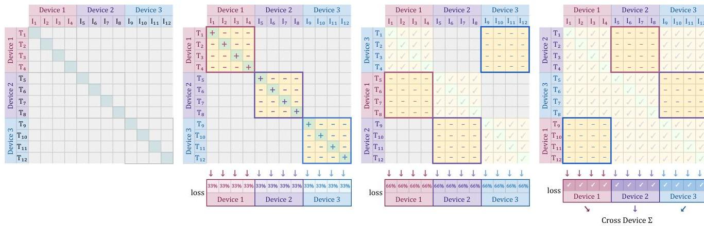

The independence of sigmoid loss terms enables a "chunked" distributed training strategy that dramatically reduces memory requirements. Instead of materializing the full |B|×|B| similarity matrix, each device:

1. Computes loss for local positive pairs and local negatives
2. Exchanges embeddings with other devices in a cyclic manner
3. Computes loss for "chunked" cross-device negatives
4. Repeats until all cross-device pairs are processed

This approach **reduces peak memory from O(|B|²) to O(b²)** where b is the per-device batch size, enabling much larger global batch sizes on limited hardware.

  

    ❗
    <strong>CLIP & SigLIP Embedding Exchange Method</strong>
  

  

  
CLIP all-gathers the entire global batch before computing softmax; SigLIP cyclically exchanges smaller embedding chunks and computes independent sigmoid losses along the way.</b>

### SigLIP batch size result

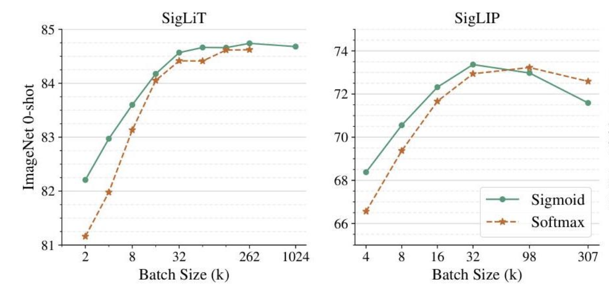

The authors tested their method via two types of models. 

1. **SigLiT (Sigmoid + Locked-image Text tuning)**: Uses a frozen, pre-trained vision backbone while training only the text encoder from scratch. This highly efficient approach achieved 84.5% ImageNet zero-shot accuracy in just two days using only four TPUv4 chips.

2. **SigLIP (Sigmoid Language-Image Pre-training)**: Trains both image and text encoders, either from scratch or by fine-tuning pre-trained backbones. When fine-tuning, the authors discovered that disabling weight decay on pre-trained weights significantly improves performance.

There are some interesting observations:

1. Sigmoid loss consistently outperforms softmax loss when batch sizes are below 16k, making it particularly valuable for resource-constrained settings.
2. Surprisingly, performance saturates around 32k batch size for both losses, with larger batches (up to 1 million) providing minimal or even negative returns.

  

    ❗
    <strong>CLIP vs SigLIP Training Requirement</strong>
  

  

  
SigLIP achieved 73.4% ImageNet zero-shot accuracy in 5 days on 32 TPUv4, while comparable CLIP training required approximately 10 days on 256 TPUv3

## SigLIP2

SigLIP arguably overtook CLIP for open image–text representation learning.

But SigLIP’s basic recipe still had a weakness: it was mainly trained to understand the relationship between an entire image and an entire caption. That is useful for retrieval and classification, but it **does not necessarily teach the model where objects are, what individual regions contain, or how to preserve fine visual details**.

SigLIP 2 keeps SigLIP’s sigmoid image–text objective and the same general architecture. The major change is that the authors give the model several additional training tasks.

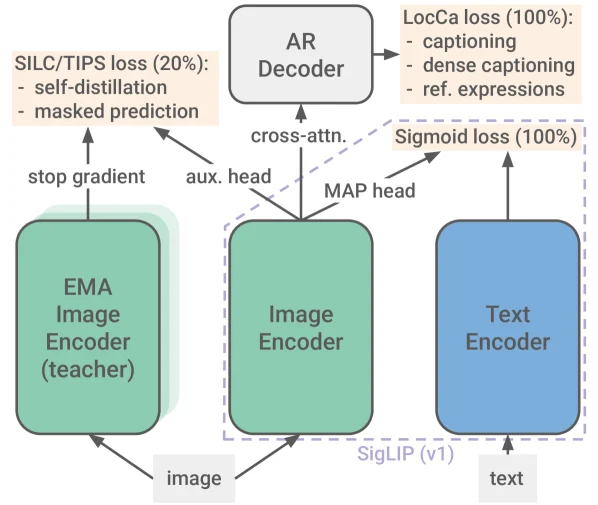

First, they attach a temporary decoder to the image encoder. 
This is known as Decoder-based Pretraining (LocCa). 

During training, this decoder is asked to refer to the vision encoder's unpooled representations and perform tasks such as generate captions, locate objects mentioned in text, and describe particular image regions. The decoder's job is to force the image encoder to retain more detailed, spatial information. During actual inference, the decoder is discarded. 
 
Next, during the final 20% of training, SigLIP 2 adds self-supervised learning with self-supervised Losses (SILC/TIPS). Here, we have a teacher network(EMA-student) and a student network(our encoder). The two losses are:
- Local-to-global consistency: “recognize the same image from a crop”
    - It is mainly about view-level or image-level consistency: it measures “Whether I see the whole image or a crop, my representation should remain semantically compatible.”
- Masked prediction: “infer what belongs at this exact location”
    - This is mainly about patch-level spatial detail: “What kind of visual feature belongs at this particular location?”

The training data is multilingual as well: WebLI contains 10 billion images and 12 billion alt-texts covering 109 languages. The mixture is mostly English, but includes non-English data and filtering intended to reduce representational bias. 

The result is a model that is not only better at saying whether an image and caption match, but also better at understanding the image’s internal structure. SigLIP 2 improves classification and retrieval, while making much larger gains on localization and dense prediction tasks. 

SigLIP 2 also introduces NaFlex variants for images whose shape matters. Instead of forcing every image into a square, NaFlex preserves the original aspect ratio and supports different numbers of image patches. That makes it better suited to documents, screenshots, and OCR, where stretching or cropping an image can destroy useful information. 

