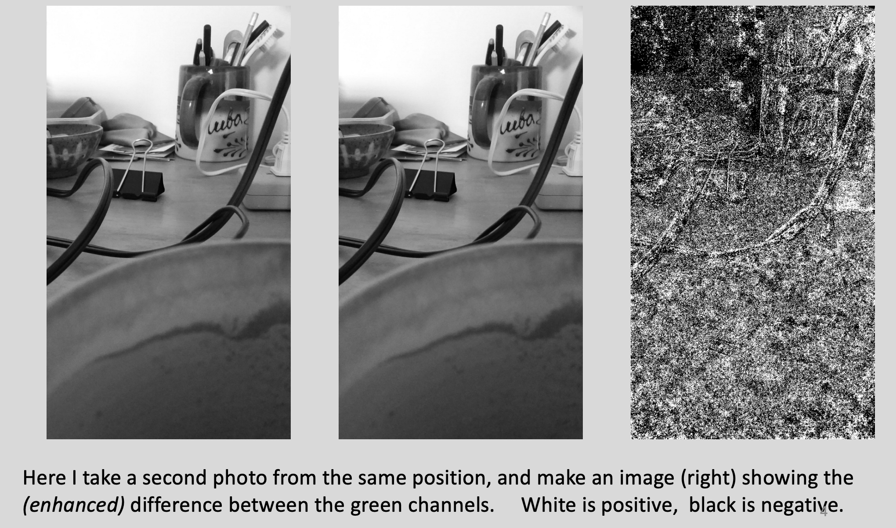
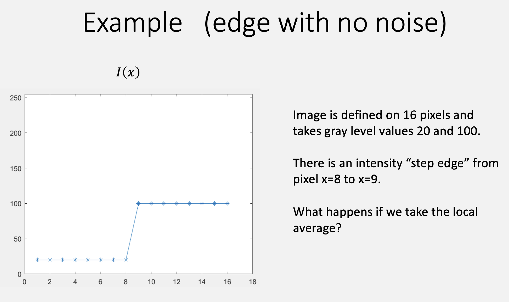
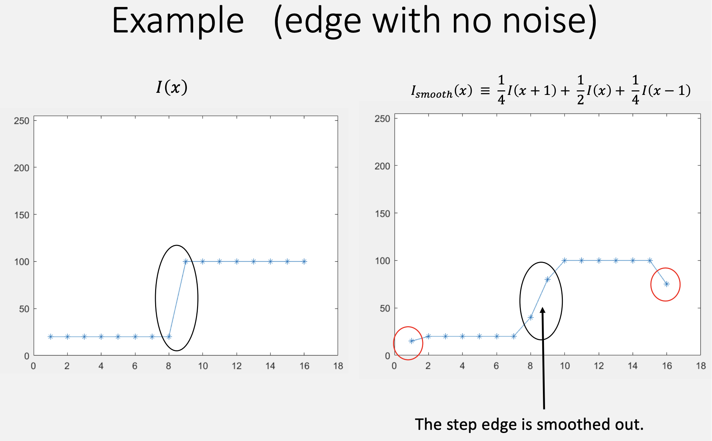

So, we are back to the very fundamentals.

Before transformers ate the world, computer vision was built on a small pile of linear-algebra tricks for pushing pixels around. Image filtering is the first of them, and almost everything later — edge detection, blob detection, SIFT, even the first layer of a CNN — is just this idea wearing a costume. So it's worth getting right. Grab a coffee.

  
Table of Contents

  <ul style="margin-top: 16px; line-height: 1.8;">
    <li><a href="#motivations" style="text-decoration: none; color: #333;">Motivations</a></li>
    <li><a href="#scenario-setup" style="text-decoration: none; color: #333;">Scenario Setup</a></li>
    <li><a href="#image-noise" style="text-decoration: none; color: #333;">Image Noise</a></li>
    <li><a href="#local-average-smoothing" style="text-decoration: none; color: #333;">Local Average (Smoothing)</a></li>
    <li><a href="#the-gaussian" style="text-decoration: none; color: #333;">The Gaussian</a></li>
    <li><a href="#local-difference" style="text-decoration: none; color: #333;">Local Difference</a></li>
    <li><a href="#from-two-operations-to-one-idea" style="text-decoration: none; color: #333;">From Two Operations to One Idea</a></li>
    <li><a href="#cross-correlation" style="text-decoration: none; color: #333;">Cross-Correlation</a></li>
    <li><a href="#convolution" style="text-decoration: none; color: #333;">Convolution</a></li>
    <li><a href="#impulse-function-and-impulse-response" style="text-decoration: none; color: #333;">Impulse Function and Impulse Response</a></li>
    <li><a href="#algebraic-properties-of-convolution" style="text-decoration: none; color: #333;">Algebraic Properties of Convolution</a></li>
    <li><a href="#boundaries-and-padding" style="text-decoration: none; color: #333;">Boundaries and Padding</a></li>
    <li><a href="#going-to-2d" style="text-decoration: none; color: #333;">Going to 2D</a></li>
    <li><a href="#image-derivatives-and-the-gradient" style="text-decoration: none; color: #333;">Image Derivatives and the Gradient</a></li>
    <li><a href="#summary" style="text-decoration: none; color: #333;">Summary</a></li>
  </ul>

# Image Filtering

## Motivations

Image filtering is a family of **local operations on an image** — you look at a small neighborhood around each pixel, take a weighted combination of the values there, and write the result back out. Two jobs make it essential, and this lecture is framed entirely around them.

**Edge detection.** An edge is a place where intensity changes sharply. Those places matter because they usually line up with something physical changing: a shadow boundary, a switch of material, the silhouette of one object against another (where depth, material, and illumination all jump at once). Finding these locations is the computational problem called *edge detection*.

**Noise reduction.** Real cameras produce noise, and the noise is roughly independent from pixel to pixel. It shows up as random little spikes in intensity scattered across the image. If we want to trust the edges we find, we first have to calm those spikes down.

  

    💡
    <strong>Definition: Edge</strong>
  

  

  
A position in an image where the intensity undergoes a large change in value.

  
The computational problem of finding intensity edges in an image is called <i>edge detection</i>.

To spot an edge you have to compare pixels in a local neighborhood and look for a big change. To calm noise you have to blend a local neighborhood together. Both come down to taking **linear combinations of nearby intensities**, and there are two basic ones to study: **local averages** and **local differences**.

## Scenario Setup

Two simplifications, kept for the whole lecture:

1. **One channel, not three.** Colour images are RGB, but at each pixel the R, G, and B values are heavily correlated, so unless you're specifically doing colour work it's standard in vision to develop everything on a single gray-level channel. We'll call it *intensity*.
2. **1D before 2D.** Real images are $I(x, y)$. Every core idea shows up already in a 1D "image" $I(x)$, so we start there and lift everything to 2D at the end.

The running goal: **detect edges in the presence of noise.**

## Image Noise

Here's the thing about noise: take two photos of the same scene, from the same tripod, nothing moving — and the two images are still not equal.

*Left and middle: the same desk, photographed twice from the same spot. Right: the (contrast-enhanced) difference between the two green channels — white is positive, black is negative. If the camera were noiseless this image would be flat gray.*

That difference image is pure sensor noise. In this example its standard deviation is about **4.8 gray levels**, and — crucially — it is essentially independent from one pixel to the next. That independence is the property we're about to exploit.

## Local Average (Smoothing)

Intensity in a natural image drifts slowly from pixel to pixel — except at edges. Noise, by contrast, jumps around independently at every pixel. So if we replace each pixel with a **weighted average of its neighbors**, the slow-moving signal survives while the fast, independent jitter partially cancels.

The simplest version:

$$I_{smooth}(x) \;\equiv\; \tfrac{1}{4}I(x+1) + \tfrac{1}{2}I(x) + \tfrac{1}{4}I(x-1)$$

The weights $\tfrac14, \tfrac12, \tfrac14$ are a choice, not a law — $\tfrac13, \tfrac13, \tfrac13$ would also be fine. The **one real constraint is that the weights sum to 1**. If they didn't, the operation would scale the image brighter or darker on top of smoothing it, and it wouldn't be an *average* anymore.

  

    🧮
    <strong>Example: Smoothing a Noisy Flat Signal</strong>
  

  

  
Let $I(x) = 100 + \text{(independent noise)}$ — a constant signal buried in per-pixel jitter. Applying $I_{smooth}$ mixes each pixel with its two neighbors, and because the noise terms are independent with mean zero, they partly cancel: the smoothed signal stays near 100 but with visibly smaller wiggle.

  
One wrinkle shows up at the very ends of the signal. A tool like Matlab treats $I(x)$ as zero outside the range where it's defined, so the average at the first and last pixel blends in a phantom 0 and the smoothed value there dips toward zero. That's not smoothing — that's a boundary artifact, and we deal with it in <a href="#boundaries-and-padding" style="color:#227ac2;">Boundaries and Padding</a>.

Now watch what smoothing does to a clean edge — no noise at all this time.

*The test signal: a 1D image on 16 pixels taking values 20 and 100, with a step edge between $x=8$ and $x=9$. What happens if we take the local average?*

*Applying $I_{smooth}(x) \equiv \tfrac14 I(x+1) + \tfrac12 I(x) + \tfrac14 I(x-1)$: the step edge is smeared across several pixels (black circle). The red circles at the two ends are the same zero-padding boundary artifact from the box above.*

So smoothing is a trade.

  

    ⚠️
    <strong>Watch Out: Smoothing Also Blurs the Signal</strong>
  

  

  
Averaging can't tell the difference between "noise I want gone" and "a real edge I want kept" — it's a linear operation applied blindly everywhere. Kill more noise and you also soften more edges. This tension between noise suppression and edge preservation is the reason edge detection is hard, and it drives a lot of what comes in later lectures.

  
Also: the local average is <b>undefined at the first and last pixel</b>, because one of the neighbors falls off the end of the image.

Nothing forces us to stop at three taps. We can average over a wider neighborhood for stronger smoothing, e.g.

$$I_{smooth}(x) \;\equiv\; \tfrac{3}{16}I(x+1) + \tfrac{1}{2}I(x) + \tfrac{3}{16}I(x-1) + \tfrac{1}{16}I(x+2) + \tfrac{1}{16}I(x-2)$$

which still sums to 1. But now the question is unavoidable: **how do we choose the weights?** Picking fractions by hand doesn't scale. We want a principled shape.

## The Gaussian

The standard answer is the **Gaussian**. In 1D, with mean $\mu$ and standard deviation $\sigma$:

$$G(x; \mu, \sigma) \;=\; \frac{1}{\sqrt{2\pi}\,\sigma}\; e^{-\frac{(x-\mu)^2}{2\sigma^2}}$$

For smoothing we always center it, $\mu = 0$ (if no $\mu$ is given, assume $0$). That leaves **$\sigma$ as the only knob, and it sets the width of the blur**. The leading constant $\frac{1}{\sqrt{2\pi}\,\sigma}$ is a normalizer that makes the continuous Gaussian integrate to 1.

In probability this is the *normal* distribution; in vision it's the *Gaussian*, after Gauss, who worked out many of its properties. (They put both his face and this formula on the old German 10-mark note.)

  

    ➕
    <strong>Why this shape? (a Central Limit Theorem aside)</strong>
  

  

  
Let $X_1, X_2, \dots, X_n$ be independent, identically distributed random variables with mean $\mu$ and variance $\sigma^2$. The Central Limit Theorem says their average $\frac{1}{n}(X_1 + X_2 + \dots + X_n)$, once suitably recentered and rescaled, converges in distribution to a Gaussian — <b>whatever the original distribution was</b>.

  
So the Gaussian is the natural "shape of an average." When you build a smoothing filter — literally a weighted average of pixels — reaching for a Gaussian is reaching for the distribution that averaging pulls everything toward anyway.

Two practical notes, then the payoff:

- **Discrete renormalization.** The continuous Gaussian integrates to 1, but we don't get the continuous function — we sample it at integer pixel offsets, and those samples do *not* sum to exactly 1 in general. So in practice you sample $G$ over a finite window and divide by the sum, forcing the weights back to 1 so average brightness is preserved.
- **It's the same tool later.** Gaussians come back when we discuss scale space, so this is not a one-off.

  

    ❗
    <strong>Important Takeaway: σ Controls the Trade-off</strong>
  

  

  
As you increase the scale $\sigma$, you <b>reduce noise more</b> (you're averaging more independent samples) but you also <b>average together more pixels, blurring the signal more</b>. Every smoothing decision in vision is a choice of $\sigma$ along this axis.

## Local Difference

Smoothing was about killing the fast stuff. Edge detection is the opposite: we want to **enhance** the places where intensity changes fast, because those are the edges.

The tool is an approximation to the first derivative, the **central difference**:

$$\frac{dI(x)}{dx} \;\approx\; I_{diff}(x) \;=\; \tfrac{1}{2}I(x+1) - \tfrac{1}{2}I(x-1)$$

It's called *central* because it's symmetric about the pixel $x$ — it looks one step each way and never at $x$ itself.

  

    ➕
    <strong>Math Review: why is that a derivative?</strong>
  

  

  
The derivative of a continuous function has a symmetric form:

$$f'(x) = \lim_{h \to 0} \frac{f(x+h) - f(x-h)}{2h}$$

  
An image is discrete, so the smallest step is one pixel: set $h = 1$ and drop the limit.

$$f'(x) \approx \frac{I(x+1) - I(x-1)}{2} = \tfrac{1}{2}I(x+1) - \tfrac{1}{2}I(x-1)$$

  
Why symmetric instead of the one-sided $I(x+1) - I(x)$? A Taylor expansion shows the one-sided version has error $O(h)$, while the symmetric one cancels that first-order term and is accurate to $O(h^2)$. It also stays centered on pixel $x$, so it doesn't shift edges sideways.

Reading the output:

- A large **positive** $I_{diff}(x)$ means an edge going **low &rarr; high** intensity.
- A large **negative** $I_{diff}(x)$ means an edge going **high &rarr; low**.

Intuitively: a step edge is a cliff in the intensity, and the derivative of a cliff is a spike. Find the spikes, you've found the edges.

  

    🧮
    <strong>Example: Local Difference on a Step Edge</strong>
  

  

  
A 1D image with a single edge at $x = x_0$:

$$I(x) = \begin{cases} 100, & x > x_0 \\ 70, & x = x_0 \\ 40, & x < x_0 \end{cases}$$

  
Applying $I_{diff}(x) = \tfrac{1}{2}I(x+1) - \tfrac{1}{2}I(x-1)$:

$$I_{diff}(x) = \begin{cases} 0, & x > x_0 + 1 \\ 15, & x = x_0 + 1 \\ 30, & x = x_0 \\ 15, & x = x_0 - 1 \\ 0, & x < x_0 - 1 \end{cases}$$

  
The response peaks in absolute value <b>exactly at the edge</b>, $x = x_0$, and is zero out in the flat regions. The step edge produced a peak in the first derivative, just as promised.

Like the local average, $I_{diff}(x)$ is **undefined at the first and last pixel**. And more generally, once you have differences and averages you can go further: take second-order (and higher) derivatives, chain a smoothing step and a difference step together (calm the noise, *then* differentiate), or write down any local linear combination you like.

## From Two Operations to One Idea

Put the two operations side by side:

- **Local average:** $I_{smooth}(x) = \tfrac{1}{4}I(x+1) + \tfrac{1}{2}I(x) + \tfrac{1}{4}I(x-1)$
- **Local difference:** $I_{diff}(x) = \tfrac{1}{2}I(x+1) - \tfrac{1}{2}I(x-1)$

Both take the image, look at a **small neighborhood** around a pixel, and return a **fixed-weight linear combination** of the values there. If we treat $I(x)$ as an $N$-dimensional vector, each operation is a linear map — an $N \times N$ matrix — but a very special one: almost all entries are zero, and the nonzero weights depend only on *how far apart* two pixels are, not on where they sit.

Writing out an $N \times N$ matrix to encode "same little stencil, everywhere" is wasteful. The compact way to say it is **convolution** (and its near-twin, **cross-correlation**). We'll define cross-correlation first because it matches intuition, then convolution because it has the nicer algebra.

## Cross-Correlation

$$f(x) \otimes I(x) \;\equiv\; \sum_{u} f(u - x)\, I(u)$$

Read it as: place a copy of the template $f$ at position $x$, then slide $u$ over the image and sum up the image values weighted by $f$. Think of $f$ as a **template you're matching against the image by an inner product** — "how well does the filter match the image when it's centered at $x$?"

The key feature: **no sign flip.** An offset of $+1$ into the image is read by $f(+1)$. The kernel's index *is* the direction you look. This is exactly the "slide a template across the image" picture most people already have.

  

    🧮
    <strong>Example: Reading Off f from a Cross-Correlation</strong>
  

  

  
Suppose $f(x) \otimes I(x) \equiv \tfrac{1}{4}I(x+1) + \tfrac{1}{2}I(x) + \tfrac{1}{4}I(x-1)$. Using $\sum_u f(u-x)\,I(u)$, the term multiplying $I(x+1)$ has $u = x+1$, so its weight is $f(+1)$; the term for $I(x-1)$ is $f(-1)$; the term for $I(x)$ is $f(0)$. So:

  
$f(x) = \tfrac{1}{4}$ at $x = +1, -1$; &nbsp; $f(x) = \tfrac{1}{2}$ at $x = 0$; &nbsp; $f(x) = 0$ otherwise.

  
Coefficients come out in the same order as the formula — because there's no flip.

An equivalent form drops out if you substitute $u = a + x$:

$$f(x) \otimes I(x) \;=\; \sum_{a} f(a)\, I(a + x)$$

Same operation, written as "for each offset $a$, weight the pixel $a$ steps from $x$ by $f(a)$."

## Convolution

$$f(x) * I(x) \;\equiv\; \sum_{u} f(x - u)\, I(u)$$

One character different from cross-correlation: $f(x-u)$ instead of $f(u-x)$. But the mental picture flips. Convolution **sums up shifted copies of $f$, each copy weighted by an image value** — "how much does the image intensity at position $x$ contribute to the filtered output?"

Spelling out the sum makes the "shifted copies" idea concrete:

$$f(x) * I(x) = \cdots + f(x{+}1)\,I({-}1) + f(x)\,I(0) + f(x{-}1)\,I(1) + f(x{-}2)\,I(2) + \cdots$$

  

    💡
    <strong>Definition: Filter (Kernel)</strong>
  

  

  
Convolving an image $I(x)$ with a function $f(x)$ is called <b>filtering the image</b>. The function $f(x)$ is the <b>filter</b> (also called the <b>kernel</b>), and it is understood to be $0$ outside the small range where its weights are listed.

  
Local difference filter: $f(-1) = \tfrac{1}{2},\; f(0) = 0,\; f(1) = -\tfrac{1}{2}$. &nbsp; Local average filter: $f(-1) = \tfrac{1}{4},\; f(0) = \tfrac{1}{2},\; f(1) = \tfrac{1}{4}$.

  

    🧮
    <strong>Example: The Sign Flip in Action</strong>
  

  

  
<b>Local difference as a convolution.</b> $I_{diff}(x) = \tfrac{1}{2}I(x+1) - \tfrac{1}{2}I(x-1)$. In $\sum_u f(x-u)\,I(u)$, the term with $I(x+1)$ needs $u = x+1$, i.e. weight $f(-1)$; the term with $I(x-1)$ needs $f(+1)$. So $f(-1) = +\tfrac{1}{2}$ and $f(+1) = -\tfrac{1}{2}$ — <b>the coefficients look reversed</b> relative to the $I_{diff}$ formula. An image offset of $+1$ is read by $f(-1)$. That sign flip is the entire personality of convolution.

  
<b>Local average as a convolution.</b> $f(-1) = f(1) = \tfrac{1}{4}$, $f(0) = \tfrac{1}{2}$. This filter is symmetric, $f(b) = f(-b)$, so the flip has no visible effect and the order looks unchanged.

  
<b>Reading one off.</b> Given $f(x) * I(x) = -3\,I(x+2) + 4\,I(x+1) + 2\,I(x-2)$, an offset $+k$ maps to index $-k$, so $f(-2) = -3$, $f(-1) = 4$, $f(2) = 2$, and $0$ otherwise. Convolution is a fully general operation — the filter doesn't have to mean anything.

  

    ➕
    <strong>Convolution vs. Cross-Correlation, in one line</strong>
  

  

  
Convolution: $\sum_u f(x-u)\,I(u)$. &nbsp; Cross-correlation: $\sum_u f(u-x)\,I(u)$. They differ by one sign in the argument of $f$ — equivalently, convolution flips the kernel before sliding it and cross-correlation does not.

  
Any cross-correlation is a convolution with the flipped filter, and vice versa. So they carry the same information; they're just two conventions.

  
If the filter is <b>symmetric</b> ($f(b) = f(-b)$) — which every averaging filter, including the Gaussian, is — the two operations give <b>identical results</b>. The distinction only bites for asymmetric filters like the derivative.

## Impulse Function and Impulse Response

The simplest possible input is a single spike.

  

    💡
    <strong>Definition: Impulse Function</strong>
  

  

  
An <b>impulse</b> has value 1 at one pixel and 0 everywhere else. At the origin:

$$\delta(x) = \begin{cases} 1, & x = 0 \\ 0, & \text{otherwise} \end{cases}$$

  
and shifted to $x_0$:

$$\delta(x - x_0) = \begin{cases} 1, & x = x_0 \\ 0, & \text{otherwise} \end{cases}$$

Two facts fall straight out of the definition of convolution:

$$\delta(x) * I(x) = I(x) \qquad\text{and}\qquad \delta(x) * f(x) = f(x)$$

The first: $\sum_u \delta(x-u)\,I(u) = I(x)$, since $\delta(x-u)$ is zero unless $u = x$. The second is the same statement with $f$ in place of $I$.

  

    💡
    <strong>Definition: Impulse Response Function</strong>
  

  

  
Because $\delta(x) * f(x) = f(x)$, the filter $f(x)$ is literally the output you get when the input is a single impulse at the origin. For that reason a filter is also called the <b>impulse response function</b>.

Here's the intuition that makes convolution click. **Any image is a sum of shifted, scaled impulses** — one per pixel, each scaled by that pixel's intensity. Convolution is linear, so filtering the whole image is the same as filtering each impulse separately and adding up the results. Each impulse contributes one copy of $f$, shifted to its pixel and scaled by its intensity. That is exactly what $\sum_u f(x-u)\,I(u)$ says: **stack up one impulse response per pixel.**

## Algebraic Properties of Convolution

If we pad both functions with zeros so they're defined on all integers, convolution obeys three laws (all for arbitrary filters $f_1, f_2, f_3$).

**Commutative.** $f_1 * f_2 = f_2 * f_1$.

*Proof.* Start from $I(x) * f(x) = \sum_{u=-\infty}^{\infty} I(u)\, f(x - u)$. Substitute $b = x - u$; as $u$ ranges over all integers so does $b$, and

$$\sum_{b=-\infty}^{\infty} I(x - b)\, f(b) = \sum_{b=-\infty}^{\infty} f(b)\, I(x - b) = f(x) * I(x). \qquad \blacksquare$$

The zero-padding is what lets us run the sum from $-\infty$ to $\infty$ and reindex freely. **Cross-correlation does not have this property** — swapping the operands changes the result — except, again, when $f$ is symmetric.

**Associative.** $(f_1 * f_2) * f_3 = f_1 * (f_2 * f_3)$. Applying two filters in sequence is the same as merging them into one filter first, then applying that once.

**Distributive.** $(f_1 + f_2) * f_3 = f_1 * f_3 + f_2 * f_3$. Filtering a sum equals summing the filtered pieces — convolution is linear.

  

    ❗
    <strong>Important Takeaway: Why These Laws Matter</strong>
  

  

  
Vision pipelines chain filters — smooth, then differentiate, then... Associativity and commutativity mean <b>you can reorder and pre-combine those steps</b> without changing the answer (and often to save computation).

  
Distributivity handles noise cleanly: if $I_{\text{observed}} = I + n$ (signal plus additive noise), then blurring-and-differentiating the observed image equals doing it to $I$ and to $n$ separately and adding. You can reason about what a filter does to the signal and to the noise <b>independently</b>.

## Boundaries and Padding

The definitions never said which indices $u$ the sum runs over, or where $I$ and $f$ live. Typically $I(x)$ is defined on $0, \dots, N-1$ (or $1, \dots, N$ in Matlab) and $f(x)$ on a tiny range like $\{-1, 0, 1\}$. When the filter hangs off the edge of the image, some taps have no pixel to multiply.

The simplest fix is **zero-padding**: pretend both functions are defined on all integers and are 0 wherever they weren't specified. This can be done implicitly (just assume it) or explicitly (actually grow the vector with zeros). It's also what silently causes the end-of-signal dips we saw earlier.

When you compute a convolution of two finite vectors, there are three conventions for the output size:

1. Pad with zeros and keep **every** relative position — output is larger than the input.
2. Keep only the positions where the output has the **same size** as the input.
3. Keep only positions where the shorter vector is **fully inside** the longer one — output is smaller.

  

    ⚠️
    <strong>Watch Out</strong>
  

  

  
Near the image border the filtered values depend on your padding choice, not just on the image. Zero-padding darkens edges; other schemes (replicate the border pixel, reflect, wrap) trade one artifact for another. There's no free lunch, and assignments will make you deal with it.

*(Continuous convolution, $f * I \equiv \int f(x-u)\,I(u)\,du$, is defined by analogy. The impulse function is more delicate in the continuous setting, and we won't need it.)*

## Going to 2D

Everything lifts to images $I(x, y)$ by adding a second index.

$$
\begin{aligned}
\text{2D convolution:} \quad & f(x,y) * I(x,y) \equiv \sum_{u,v} f(x - u,\, y - v)\, I(u, v) \\[4pt]
\text{2D cross-correlation:} \quad & f(x,y) \otimes I(x,y) \equiv \sum_{u,v} f(u - x,\, v - y)\, I(u, v)
\end{aligned}
$$

Same two readings as in 1D: cross-correlation slides a 2D template and takes an inner product at each location; convolution sums the impulse responses contributed by every pixel.

### The 2D Gaussian

$$G(x, y; \sigma) \;=\; \frac{1}{2\pi\sigma^2}\; e^{-\frac{x^2 + y^2}{2\sigma^2}}$$

(mean $(0,0)$, same $\sigma$ in both directions — the general case allows a nonzero mean and elliptical spread). Three properties carry the weight:

- **Separable.** It factors into a 1D Gaussian in $x$ times a 1D Gaussian in $y$: $\;G(x,y;\sigma) = G(x;\sigma)\,G(y;\sigma)$.
- **Radially symmetric.** It depends only on $x^2 + y^2$, so it blurs the same in every direction and won't smear features along an axis.
- **Integrates to 1.** Because it's separable, the 2D integral splits into two 1D integrals, each equal to 1.

2D smoothing is then just $I_{smooth}(x, y) = G(x, y; \sigma) * I(x, y)$ — a local weighted average whose weights sum to 1.

  

    ❗
    <strong>Important Takeaway: Separability Is a Speedup</strong>
  

  

  
Because the 2D Gaussian is separable, blurring an $M \times M$ image with an $N$-wide kernel can be done as a 1D horizontal pass followed by a 1D vertical pass. That's $O(N M^2)$ work instead of $O(N^2 M^2)$ for the naive 2D convolution — a factor of $N$ saved, for free, from a property of the function.

## Image Derivatives and the Gradient

The 1D central difference generalizes to partial derivatives, one per axis:

$$
\frac{\partial I}{\partial x} \approx \tfrac{1}{2}I(x{+}1, y) - \tfrac{1}{2}I(x{-}1, y), \qquad
\frac{\partial I}{\partial y} \approx \tfrac{1}{2}I(x, y{+}1) - \tfrac{1}{2}I(x, y{-}1)
$$

Stack them into the **image gradient**:

$$\nabla I(x, y) \;\equiv\; \left( \frac{\partial I}{\partial x},\; \frac{\partial I}{\partial y} \right)$$

The gradient answers two questions at once: **which direction does intensity climb fastest, and how steep is that climb?** Its direction points up the steepest intensity slope (across an edge, not along it), and its **magnitude**

$$\|\nabla I(x, y)\| \;=\; \sqrt{\left(\frac{\partial I}{\partial x}\right)^2 + \left(\frac{\partial I}{\partial y}\right)^2} \;\approx\; \tfrac{1}{2}\sqrt{\big(I(x{+}1,y) - I(x{-}1,y)\big)^2 + \big(I(x,y{+}1) - I(x,y{-}1)\big)^2}$$

is large exactly where the image has a strong edge. That scalar field — big at edges, near zero on flat regions — is the raw material for the edge detectors in the next lecture.

## Summary

- **Image noise** is roughly independent per pixel; **smoothing** (local weighted average, weights summing to 1) suppresses it, at the cost of blurring real signal.
- **Local differences** (the central difference) approximate the derivative and spike at edges.
- The **Gaussian** is the principled smoothing weight; $\sigma$ trades noise reduction against blur.
- **Cross-correlation** ("match a template") and **convolution** ("sum shifted impulse responses") differ by one sign flip; they agree when the filter is symmetric. Convolution is commutative, associative, and distributive.
- An **impulse** passes a filter through unchanged, which is why a filter is its own impulse response.
- Everything extends to **2D**; the Gaussian's separability makes 2D smoothing cheap, and the **image gradient** packages the two partial derivatives into a direction-and-steepness field that feeds edge detection.
